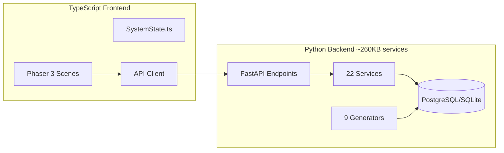
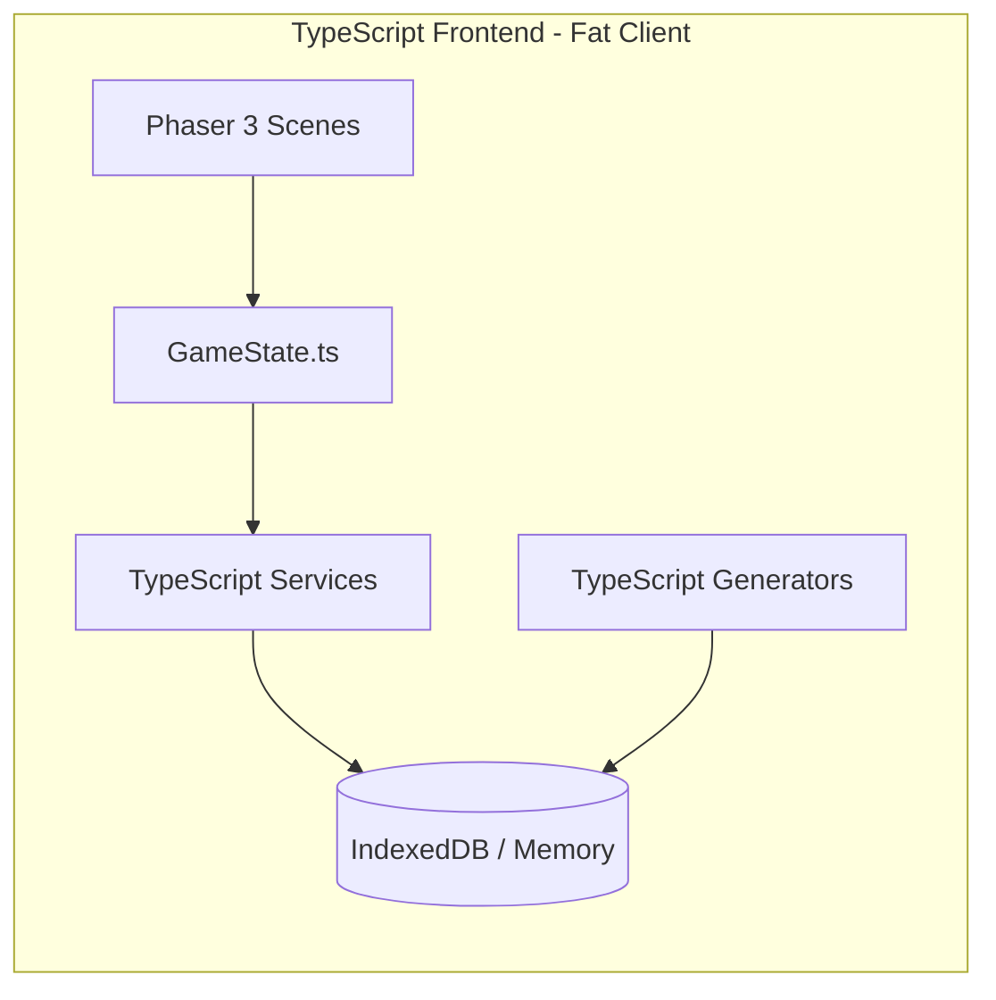
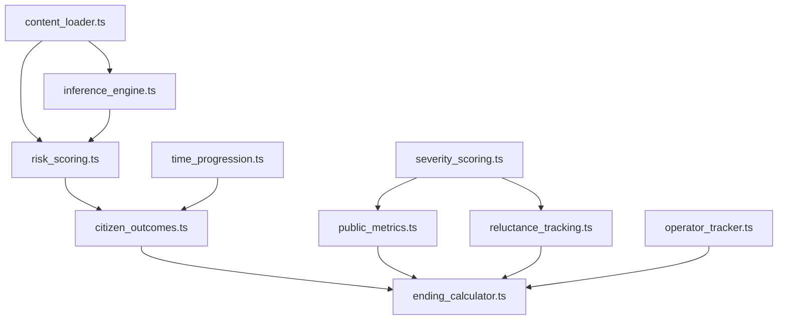

# Backend to Client-Side Migration Plan

## Problem Statement

The current **thin client architecture** requires a backend server and database per player, making it expensive and complex to host a multiplayer-ready public game. This migration will move all game logic to the frontend (TypeScript), enabling:

- **Free static hosting** (Vercel, Netlify, GitHub Pages)
- **Unlimited concurrent players** with zero server cost
- **Instant gameplay** with no network latency for game logic
- **Offline capability** (optional IndexedDB persistence)

## Current Architecture Overview



## Target Architecture



---

## Migration Phases

### Phase 1: Core Types and Data Models
**Effort: Low (~2-3 days) | Priority: CRITICAL | Dependencies: None**

Port the data model definitions. These are already 80% done in `frontend/src/types/`, but need completion.

| Python File | TypeScript File | Status | Notes |
|-------------|-----------------|--------|-------|
| [models/npc.py](file:///home/selim/data_privacy_distopia/backend/src/datafusion/models/npc.py) | [types/npc.ts](file:///home/selim/data_privacy_distopia/frontend/src/types/npc.ts) | ✅ Partial | Add `Role` enum, complete fields |
| [models/health.py](file:///home/selim/data_privacy_distopia/backend/src/datafusion/models/health.py) | `types/health.ts` | ❌ New | `Severity` enum, condition/medication/visit types |
| [models/finance.py](file:///home/selim/data_privacy_distopia/backend/src/datafusion/models/finance.py) | `types/finance.ts` | ❌ New | `AccountType`, `DebtType`, `EmploymentStatus`, `TransactionCategory` |
| [models/judicial.py](file:///home/selim/data_privacy_distopia/backend/src/datafusion/models/judicial.py) | `types/judicial.ts` | ❌ New | `CrimeType`, arrests, charges, sentences |
| [models/location.py](file:///home/selim/data_privacy_distopia/backend/src/datafusion/models/location.py) | `types/location.ts` | ❌ New | Location records, check-ins |
| [models/social.py](file:///home/selim/data_privacy_distopia/backend/src/datafusion/models/social.py) | `types/social.ts` | ❌ New | Posts, relationships, platforms |
| [models/system_mode.py](file:///home/selim/data_privacy_distopia/backend/src/datafusion/models/system_mode.py) | [types/system.ts](file:///home/selim/data_privacy_distopia/frontend/src/types/system.ts) | ✅ Complete | Already comprehensive |

#### Deliverables
-  Create `frontend/src/types/health.ts`
-  Create `frontend/src/types/finance.ts`  
-  Create `frontend/src/types/judicial.ts`
-  Create `frontend/src/types/location.ts`
-  Create `frontend/src/types/social.ts`
-  Update `frontend/src/types/npc.ts` with complete model
-  Create `frontend/src/types/index.ts` barrel export

---

### Phase 2: Static Data & Content
**Effort: Low (~1 day) | Priority: HIGH | Dependencies: None**

Move all JSON data files to the frontend `public/` directory. These are game content files that don't change per-player.

| Backend Data File | Frontend Location | Size |
|-------------------|-------------------|------|
| [data/reference/health.json](file:///home/selim/data_privacy_distopia/backend/data/reference/health.json) | `public/data/reference/health.json` | 2.4KB |
| [data/reference/finance.json](file:///home/selim/data_privacy_distopia/backend/data/reference/finance.json) | `public/data/reference/finance.json` | 1.4KB |
| [data/reference/judicial.json](file:///home/selim/data_privacy_distopia/backend/data/reference/judicial.json) | `public/data/reference/judicial.json` | 3.3KB |
| [data/reference/social.json](file:///home/selim/data_privacy_distopia/backend/data/reference/social.json) | `public/data/reference/social.json` | 7.4KB |
| [data/config/risk_factors.json](file:///home/selim/data_privacy_distopia/backend/data/config/risk_factors.json) | `public/data/config/risk_factors.json` | 2.4KB |
| [data/config/keywords.json](file:///home/selim/data_privacy_distopia/backend/data/config/keywords.json) | `public/data/config/keywords.json` | 1.6KB |
| [data/config/correlation_alerts.json](file:///home/selim/data_privacy_distopia/backend/data/config/correlation_alerts.json) | `public/data/config/correlation_alerts.json` | 1.4KB |
| [data/directives.json](file:///home/selim/data_privacy_distopia/backend/data/directives.json) | `public/data/directives.json` | 4.6KB |
| [data/outcomes.json](file:///home/selim/data_privacy_distopia/backend/data/outcomes.json) | `public/data/outcomes.json` | 7.0KB |
| [data/inference_rules.json](file:///home/selim/data_privacy_distopia/backend/data/inference_rules.json) | `public/data/inference_rules.json` | 21.2KB |
| [data/messages.json](file:///home/selim/data_privacy_distopia/backend/data/messages.json) | `public/data/messages.json` | 6.4KB |

**Total: ~59KB** (negligible for static hosting)

#### Deliverables
-  Create `frontend/public/data/` directory structure
-  Copy all JSON files from backend to frontend
-  Create `frontend/src/data/content-loader.ts` for fetching JSON
-  Add TypeScript types for JSON content schemas

---

### Phase 3: Data Generators
**Effort: Medium (~4-5 days) | Priority: HIGH | Dependencies: Phase 1, 2**

Port Python generators to TypeScript using [Faker.js](https://fakerjs.dev/) instead of Python Faker.

| Python Generator | TypeScript File | Lines | Complexity | faker.js Coverage |
|------------------|-----------------|-------|------------|-------------------|
| [generators/identity.py](file:///home/selim/data_privacy_distopia/backend/src/datafusion/generators/identity.py) | `generators/identity.ts` | 80 | Low | ✅ Full |
| [generators/health.py](file:///home/selim/data_privacy_distopia/backend/src/datafusion/generators/health.py) | `generators/health.ts` | 107 | Low | ✅ Full |
| [generators/finance.py](file:///home/selim/data_privacy_distopia/backend/src/datafusion/generators/finance.py) | `generators/finance.ts` | 247 | Medium | ✅ Full |
| [generators/judicial.py](file:///home/selim/data_privacy_distopia/backend/src/datafusion/generators/judicial.py) | `generators/judicial.ts` | ~300 | Medium | ✅ Full |
| [generators/location.py](file:///home/selim/data_privacy_distopia/backend/src/datafusion/generators/location.py) | `generators/location.ts` | ~260 | Medium | ✅ Full |
| [generators/social.py](file:///home/selim/data_privacy_distopia/backend/src/datafusion/generators/social.py) | `generators/social.ts` | 120 | Low | ✅ Full |
| [generators/messages.py](file:///home/selim/data_privacy_distopia/backend/src/datafusion/generators/messages.py) | `generators/messages.ts` | ~570 | High | ⚠️ Partial (custom logic) |
| [generators/system_seed_data.py](file:///home/selim/data_privacy_distopia/backend/src/datafusion/generators/system_seed_data.py) | `generators/system-seed.ts` | 190 | Medium | N/A (game-specific) |

#### Key Mappings

```typescript
// Python Faker → Faker.js equivalents
fake.first_name()       → faker.person.firstName()
fake.last_name()        → faker.person.lastName()
fake.ssn()              → faker.string.numeric({ length: 9 })
fake.street_address()   → faker.location.streetAddress()
fake.city()             → faker.location.city()
fake.state_abbr()       → faker.location.state({ abbreviated: true })
fake.zipcode()          → faker.location.zipCode()
fake.date_between()     → faker.date.between({ from, to })
fake.sentence()         → faker.lorem.sentence()
```

#### Deliverables
-  Install `@faker-js/faker` dependency
-  Create `frontend/src/generators/` directory
-  Port each generator file (8 files)
-  Create `frontend/src/generators/index.ts` with `generateFullPopulation()`
-  Add seeding support with `faker.seed()` for deterministic data
-  Write unit tests for generators

---

### Phase 4: Game Services (Core Logic)
**Effort: High (~7-10 days) | Priority: CRITICAL | Dependencies: Phase 1, 3**

Port the business logic services. This is the most complex phase.

#### Priority Order (by dependency graph)



#### Service Migration Table

| Python Service | TS File | Lines | Complexity | DB Deps | Notes |
|----------------|---------|-------|------------|---------|-------|
| [content_loader.py](file:///home/selim/data_privacy_distopia/backend/src/datafusion/services/content_loader.py) | `services/content-loader.ts` | 82 | Low | None | Already simple, just fetch JSON |
| [inference_engine.py](file:///home/selim/data_privacy_distopia/backend/src/datafusion/services/inference_engine.py) | `services/inference-engine.ts` | 347 | Medium | None | Pure logic, rule evaluation |
| [inference_rules.py](file:///home/selim/data_privacy_distopia/backend/src/datafusion/services/inference_rules.py) | `services/inference-rules.ts` | 69 | Low | None | Rule definitions |
| [severity_scoring.py](file:///home/selim/data_privacy_distopia/backend/src/datafusion/services/severity_scoring.py) | `services/severity-scoring.ts` | 95 | Low | None | Action severity calc |
| [risk_scoring.py](file:///home/selim/data_privacy_distopia/backend/src/datafusion/services/risk_scoring.py) | `services/risk-scoring.ts` | 706 | **High** | Reads NPC data | Core surveillance logic |
| [public_metrics.py](file:///home/selim/data_privacy_distopia/backend/src/datafusion/services/public_metrics.py) | `services/public-metrics.ts` | 220 | Medium | State updates | Awareness/anger tracking |
| [reluctance_tracking.py](file:///home/selim/data_privacy_distopia/backend/src/datafusion/services/reluctance_tracking.py) | `services/reluctance-tracking.ts` | 222 | Medium | State updates | Operator reluctance |
| [operator_tracker.py](file:///home/selim/data_privacy_distopia/backend/src/datafusion/services/operator_tracker.py) | `services/operator-tracker.ts` | 510 | **High** | State updates | Decision tracking |
| [citizen_outcomes.py](file:///home/selim/data_privacy_distopia/backend/src/datafusion/services/citizen_outcomes.py) | `services/citizen-outcomes.ts` | 360 | Medium | Reads citizen data | Outcome narratives |
| [time_progression.py](file:///home/selim/data_privacy_distopia/backend/src/datafusion/services/time_progression.py) | `services/time-progression.ts` | 115 | Low | State updates | Week progression |
| [ending_calculator.py](file:///home/selim/data_privacy_distopia/backend/src/datafusion/services/ending_calculator.py) | `services/ending-calculator.ts` | 932 | **Very High** | Many deps | Game ending logic |
| [news_system.py](file:///home/selim/data_privacy_distopia/backend/src/datafusion/services/news_system.py) | `services/news-system.ts` | 410 | High | State updates | News generation |
| [protest_system.py](file:///home/selim/data_privacy_distopia/backend/src/datafusion/services/protest_system.py) | `services/protest-system.ts` | 267 | Medium | State updates | Protest mechanics |
| [action_execution.py](file:///home/selim/data_privacy_distopia/backend/src/datafusion/services/action_execution.py) | `services/action-execution.ts` | 460 | High | Many deps | Action handling |
| [event_generation.py](file:///home/selim/data_privacy_distopia/backend/src/datafusion/services/event_generation.py) | `services/event-generation.ts` | 267 | Medium | State updates | Event triggers |
| [scenario_engine.py](file:///home/selim/data_privacy_distopia/backend/src/datafusion/services/scenario_engine.py) | `services/scenario-engine.ts` | 115 | Low | Reads config | Scenario loading |
| [content_filter.py](file:///home/selim/data_privacy_distopia/backend/src/datafusion/services/content_filter.py) | `services/content-filter.ts` | 95 | Low | None | Content moderation |
| [abuse_simulator.py](file:///home/selim/data_privacy_distopia/backend/src/datafusion/services/abuse_simulator.py) | `services/abuse-simulator.ts` | 270 | Medium | State updates | Rogue employee mode |

#### Database Replacement Strategy

Since there's no database, we need a local state store. Options:

1. **In-Memory Store** (recommended for now)
   ```typescript
   // frontend/src/state/GameStore.ts
   class GameStore {
     private npcs: Map<string, NPC> = new Map();
     private healthRecords: Map<string, HealthRecord> = new Map();
     private operator: Operator | null = null;
     // ... etc
   }
   ```

2. **IndexedDB** (for persistence across sessions)
   - Use library like `idb` or `Dexie.js`
   - Optional enhancement after in-memory works

#### Deliverables
-  Create `frontend/src/services/` directory
-  Create `frontend/src/state/GameStore.ts` (replaces database)
-  Port services in dependency order (18 files)
-  Remove all `AsyncSession` / database dependencies
-  Replace DB queries with GameStore lookups
-  Write integration tests for service chains

---

### Phase 5: State Management Refactor
**Effort: Medium (~3-4 days) | Priority: HIGH | Dependencies: Phase 4**

Refactor [SystemState.ts](file:///home/selim/data_privacy_distopia/frontend/src/state/SystemState.ts) to use local services instead of API calls.

#### Current API Calls to Replace

| API Method | Current Implementation | New Implementation |
|------------|----------------------|-------------------|
| `api.startSession()` | `POST /system/start` | `gameStore.initializeGame()` |
| `api.getDashboard()` | `GET /system/dashboard` | `dashboardService.getDashboard()` |
| `api.getCases()` | `GET /system/cases` | `caseService.getCases()` |
| `api.submitFlag()` | `POST /system/flag` | `actionService.submitFlag()` |
| `api.submitNoAction()` | `POST /system/no-action` | `actionService.submitNoAction()` |
| `api.advanceDirective()` | `POST /system/advance` | `directiveService.advance()` |
| `api.getEnding()` | `GET /system/ending` | `endingCalculator.calculate()` |

#### Deliverables
-  Refactor `SystemState.ts` to use local services
-  Remove `frontend/src/api/system.ts` (or keep as optional remote mode)
-  Update all API calls to synchronous service calls
-  Handle loading states (data generation takes ~2-3s)
-  Add progress indicator for initial population generation

---

### Phase 6: Integration & Testing
**Effort: Medium (~4-5 days) | Priority: CRITICAL | Dependencies: Phase 5**

#### Deliverables
-  End-to-end gameplay testing
-  Performance profiling (target: <3s initial load)
-  Memory usage analysis (target: <100MB for 50 NPCs)
-  Update E2E tests to work without backend
-  Add unit tests for all new TypeScript services
-  Browser compatibility testing

---

### Phase 7: Backend Deprecation
**Effort: Low (~1 day) | Priority: LOW | Dependencies: Phase 6**

#### Deliverables
-  Update `README.md` with new architecture
-  Remove backend dependency from `Makefile`
-  Update deployment docs for static hosting
-  Archive backend code (keep for reference)
-  Configure Vercel/Netlify deployment

---

## File Count Summary

| Category | Python Files | TypeScript Files Needed | Lines to Port |
|----------|-------------|------------------------|---------------|
| Models/Types | 12 | 6 new + 1 update | ~600 |
| Generators | 9 | 9 | ~1,700 |
| Services | 18 | 18 | ~5,200 |
| State | 0 | 1 (GameStore) | ~300 |
| **Total** | **39** | **35** | **~7,800** |

---

## Dependencies to Add

```json
{
  "dependencies": {
    "@faker-js/faker": "^8.4.0"
  },
  "devDependencies": {
    "idb": "^8.0.0"  // Optional, for IndexedDB persistence
  }
}
```

---

## Risk Assessment

| Risk | Likelihood | Impact | Mitigation |
|------|------------|--------|------------|
| Generator seeding differs between Python/JS | Medium | Low | Use same seed, validate outputs match |
| Performance issues with 50+ NPCs | Low | Medium | Lazy load, web workers for generation |
| IndexedDB compatibility | Low | Low | Fallback to memory-only mode |
| Complex ending calculator bugs | Medium | High | Port test cases first, TDD approach |

---

## Recommended Order of Implementation

1. **Week 1**: Phase 1 (Types) + Phase 2 (Static Data)
2. **Week 2**: Phase 3 (Generators) - parallel work possible
3. **Week 3-4**: Phase 4 (Services) - main effort
4. **Week 5**: Phase 5 (State Refactor) + Phase 6 (Testing)
5. **Week 6**: Phase 7 (Cleanup) + Deployment

**Total Estimated Effort: 4-6 weeks** depending on familiarity with TypeScript and testing rigor.

---

## User Review Required

[!IMPORTANT]
1. **Scope**: Let's migrate ONLY system mode for now.
2. **Persistence**: I want save/load game functionality (IndexedDB), fresh-start-each-session is not acceptable.
3. **Backend Retention**: Let's fully remove backend as we progress through the refactoring
4. **Testing Strategy**: Let's do what is standard for this kind of project, no need to translate python tests directly.